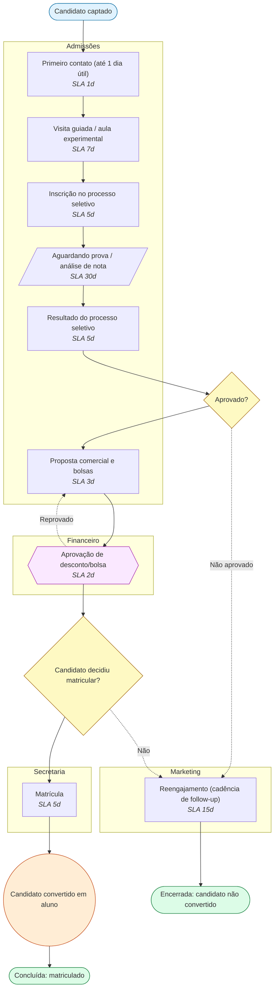
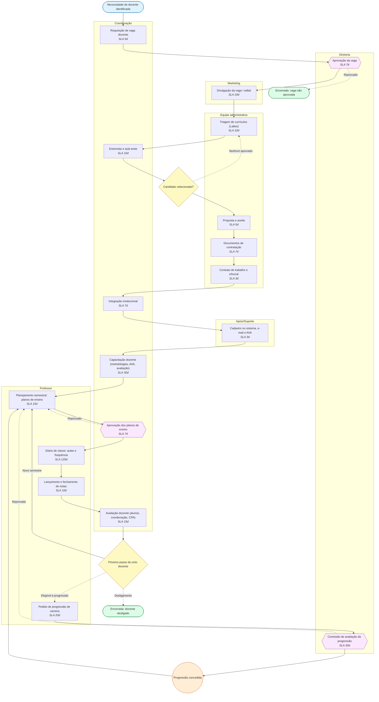
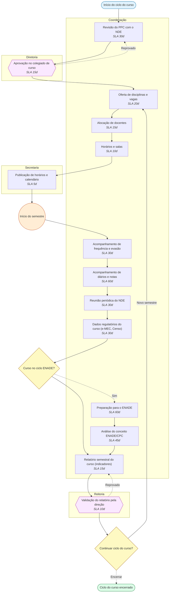
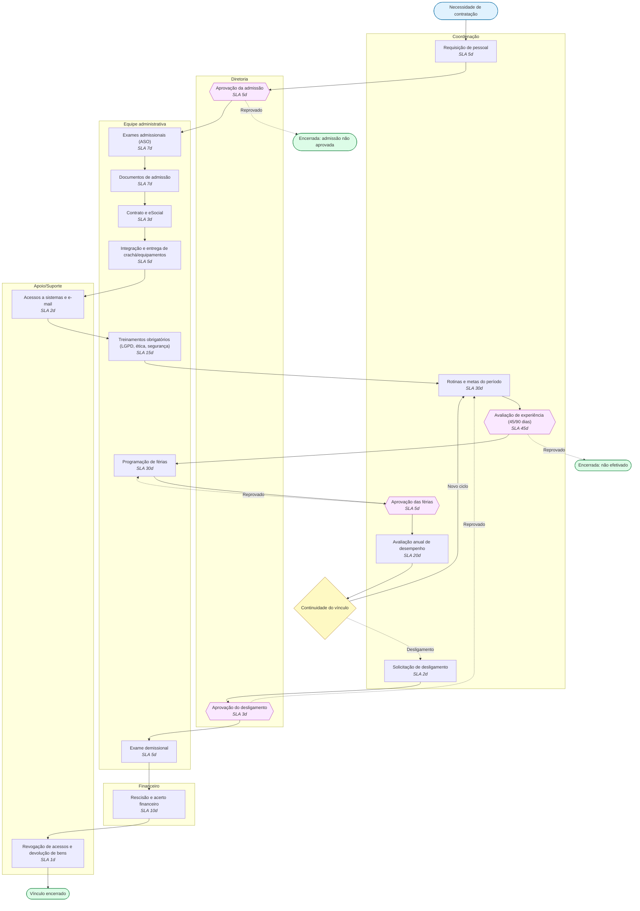
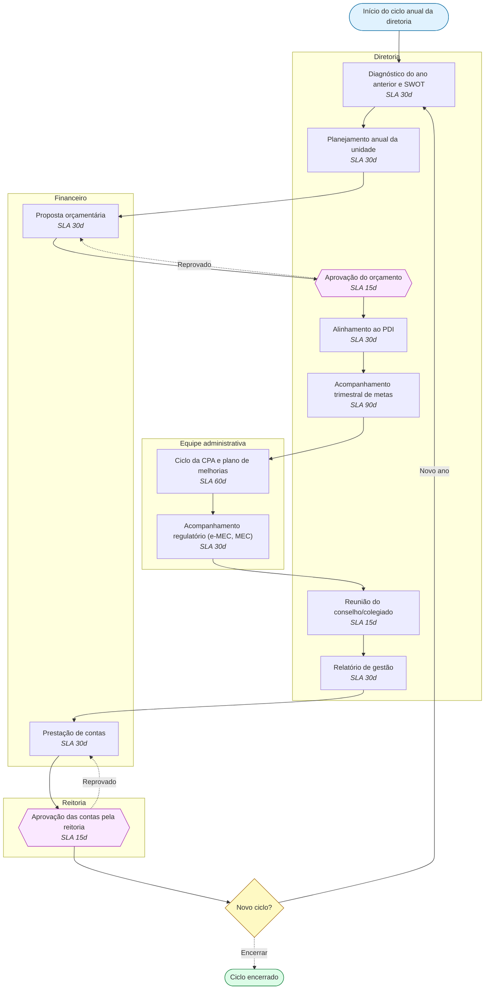
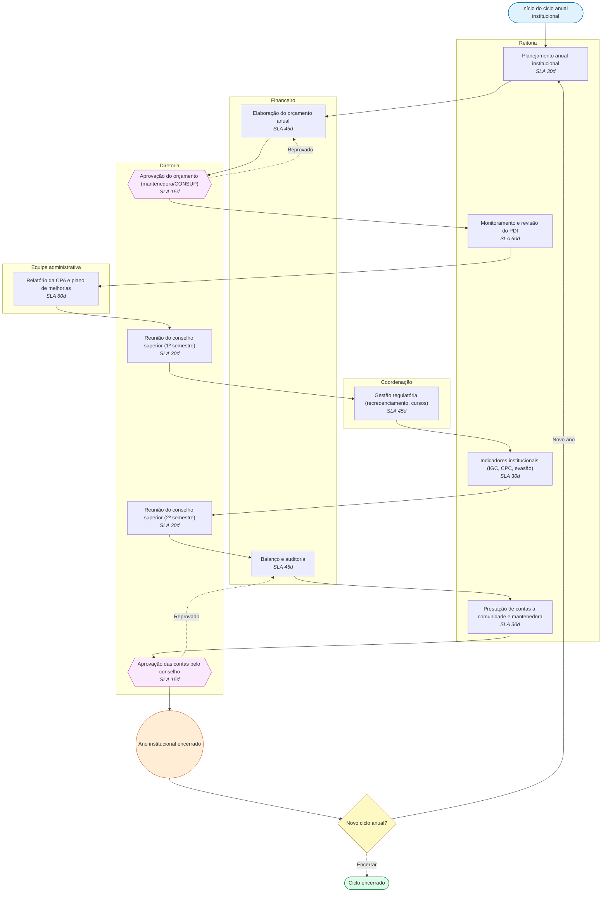
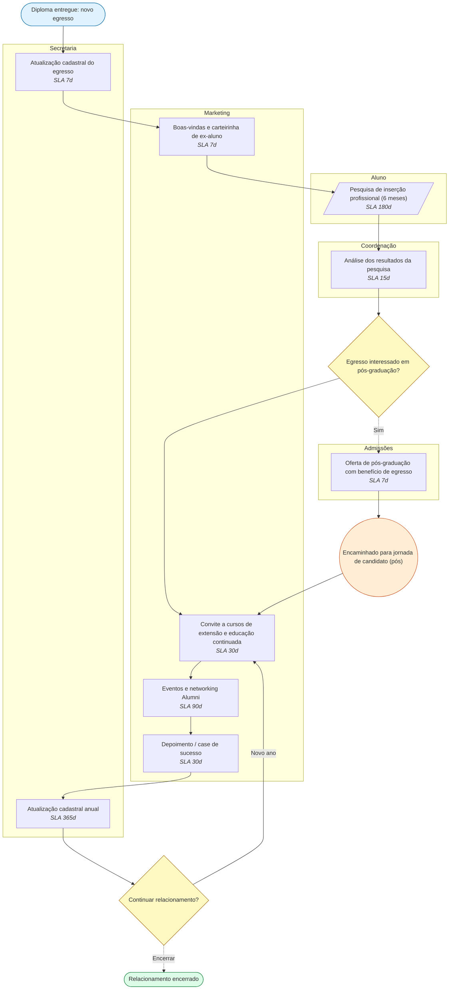

# EduMaster Pro — Fluxogramas de Jornadas

Gerado por `npx tsx src/modules/jornadas/exportMermaid.ts` a partir dos templates padrão (`backend/src/modules/jornadas/templates.ts`).
Legenda: retângulo = tarefa; hexágono = aprovação; paralelogramo = espera por evento; losango = gateway; círculo = marco; estádio = início/fim; linha tracejada = transição condicional. As raias agrupam as etapas por responsável.

## Índice

- [Jornada do aluno: do vestibular ao diploma](#aluno-padrao)
- [Jornada do candidato](#candidato-padrao)
- [Jornada do professor](#professor-padrao)
- [Jornada do coordenador de curso](#coordenador-padrao)
- [Jornada do funcionário](#funcionario-padrao)
- [Jornada da diretoria](#diretoria-padrao)
- [Jornada da reitoria](#reitoria-padrao)
- [Jornada do egresso](#egresso-padrao)

## Jornada do aluno: do vestibular ao diploma

Captação, ingresso, matrícula, vida acadêmica por período, rematrícula, estágio/TCC, ENADE, colação e diploma.

- Persona: **ALUNO** · Chave: `aluno-padrao` · 38 nós · 43 transições
- Responsáveis: Marketing, Admissões, Secretaria, Financeiro, Aluno, Apoio/Suporte, Coordenação, Professor, Biblioteca

```mermaid
flowchart TD
  n_inicio(["Interesse do futuro aluno"])
  n_gw_aprovado{"Candidato aprovado?"}
  n_marco_matriculado(("Matrícula efetivada"))
  n_gw_situacao{"Situação ao fim do período"}
  n_gw_ultimo{"Último período do curso?"}
  n_gw_enade{"Estudante habilitado ao ENADE?"}
  n_marco_egresso(("Aluno concluinte tornou-se egresso"))
  n_fim_concluido(["Jornada do aluno concluída"])
  n_fim_nao_aprovado(["Encerrada: candidato não aprovado"])
  n_fim_evasao(["Encerrada: evasão/cancelamento"])
  subgraph raia_MARKETING["Marketing"]
    n_captacao["Captação e atendimento do lead<br/><i>SLA 7d</i>"]
  end
  subgraph raia_ADMISSIONS["Admissões"]
    n_inscricao["Inscrição no processo seletivo<br/><i>SLA 3d</i>"]
    n_prova[/"Prova / avaliação de ingresso<br/><i>SLA 30d</i>"/]
    n_resultado["Apuração e divulgação do resultado<br/><i>SLA 5d</i>"]
    n_convocacao["Convocação e proposta de matrícula<br/><i>SLA 2d</i>"]
  end
  subgraph raia_SECRETARY["Secretaria"]
    n_matricula["Matrícula e contrato educacional<br/><i>SLA 5d</i>"]
    n_conferencia_docs{{"Conferência documental<br/><i>SLA 5d</i>"}}
    n_fechamento["Fechamento do período letivo<br/><i>SLA 15d</i>"]
    n_enade_inscricao["Inscrição/regularização no ENADE<br/><i>SLA 30d</i>"]
    n_enade_prova[/"Aguardando realização do ENADE<br/><i>SLA 90d</i>"/]
    n_auditoria{{"Auditoria de integralização curricular<br/><i>SLA 15d</i>"}}
    n_colacao["Colação de grau<br/><i>SLA 30d</i>"]
    n_diploma["Expedição e registro do diploma<br/><i>SLA 60d</i>"]
  end
  subgraph raia_FINANCE["Financeiro"]
    n_pagamento_1a["Pagamento da 1ª parcela / financiamento<br/><i>SLA 5d</i>"]
    n_adimplencia{{"Verificação de adimplência<br/><i>SLA 5d</i>"}}
    n_negociacao["Negociação financeira<br/><i>SLA 7d</i>"]
    n_nada_consta_fin["Nada consta financeiro<br/><i>SLA 5d</i>"]
  end
  subgraph raia_STUDENT["Aluno"]
    n_documentos["Entrega de documentos de matrícula<br/><i>SLA 15d</i>"]
    n_rematricula["Rematrícula semestral<br/><i>SLA 20d</i>"]
    n_regularizar["Regularização de pendências acadêmicas<br/><i>SLA 30d</i>"]
  end
  subgraph raia_SUPPORT["Apoio/Suporte"]
    n_acesso_ava["E-mail institucional e acesso ao AVA<br/><i>SLA 3d</i>"]
  end
  subgraph raia_COORDINATOR["Coordenação"]
    n_integracao["Integração e acolhimento de calouros<br/><i>SLA 7d</i>"]
    n_frequencia["Acompanhamento de frequência e evasão<br/><i>SLA 90d</i>"]
    n_plano_dp["Plano de dependência / adaptação<br/><i>SLA 10d</i>"]
    n_estagio["Estágio supervisionado<br/><i>SLA 180d</i>"]
  end
  subgraph raia_TEACHER["Professor"]
    n_notas["Avaliações e lançamento de notas<br/><i>SLA 120d</i>"]
    n_tcc["TCC: orientação e banca<br/><i>SLA 120d</i>"]
  end
  subgraph raia_LIBRARIAN["Biblioteca"]
    n_nada_consta_bib["Nada consta da biblioteca<br/><i>SLA 5d</i>"]
  end
  n_inicio --> n_captacao
  n_captacao --> n_inscricao
  n_inscricao --> n_prova
  n_prova --> n_resultado
  n_resultado --> n_gw_aprovado
  n_gw_aprovado -.->|"Não aprovado"| n_fim_nao_aprovado
  n_gw_aprovado --> n_convocacao
  n_convocacao --> n_matricula
  n_matricula --> n_pagamento_1a
  n_pagamento_1a --> n_documentos
  n_documentos --> n_conferencia_docs
  n_conferencia_docs -.->|"Reprovado"| n_documentos
  n_conferencia_docs --> n_marco_matriculado
  n_marco_matriculado --> n_acesso_ava
  n_acesso_ava --> n_integracao
  n_integracao --> n_frequencia
  n_frequencia --> n_notas
  n_notas --> n_fechamento
  n_fechamento --> n_gw_situacao
  n_gw_situacao -.->|"Dependência"| n_plano_dp
  n_gw_situacao -.->|"Evasão/cancelamento"| n_fim_evasao
  n_gw_situacao --> n_rematricula
  n_plano_dp --> n_rematricula
  n_rematricula --> n_adimplencia
  n_adimplencia -.->|"Reprovado"| n_negociacao
  n_adimplencia --> n_gw_ultimo
  n_negociacao --> n_adimplencia
  n_gw_ultimo -.->|"Sim"| n_estagio
  n_gw_ultimo -->|"Próximo período"| n_frequencia
  n_estagio --> n_tcc
  n_tcc --> n_gw_enade
  n_gw_enade -.->|"Habilitado"| n_enade_inscricao
  n_gw_enade --> n_auditoria
  n_enade_inscricao --> n_enade_prova
  n_enade_prova --> n_auditoria
  n_auditoria -.->|"Reprovado"| n_regularizar
  n_auditoria --> n_nada_consta_bib
  n_regularizar --> n_auditoria
  n_nada_consta_bib --> n_nada_consta_fin
  n_nada_consta_fin --> n_colacao
  n_colacao --> n_diploma
  n_diploma --> n_marco_egresso
  n_marco_egresso --> n_fim_concluido
  classDef inicio fill:#e0f2fe,stroke:#0369a1;
  classDef fim fill:#dcfce7,stroke:#15803d;
  classDef gw fill:#fef9c3,stroke:#a16207;
  classDef apr fill:#fae8ff,stroke:#a21caf;
  classDef marco fill:#ffedd5,stroke:#c2410c;
  class n_inicio inicio;
  class n_fim_concluido,n_fim_nao_aprovado,n_fim_evasao fim;
  class n_gw_aprovado,n_gw_situacao,n_gw_ultimo,n_gw_enade gw;
  class n_conferencia_docs,n_adimplencia,n_auditoria apr;
  class n_marco_matriculado,n_marco_egresso marco;
```

| Etapa | Responsável | SLA | Destino |
|---|---|---|---|
| Captação e atendimento do lead | Marketing | 7 d | admissoes /admissoes/leads |
| Inscrição no processo seletivo | Admissões | 3 d | admissoes /admissoes/inscricoes |
| Prova / avaliação de ingresso | Admissões | 30 d | admissoes /admissoes/provas |
| Apuração e divulgação do resultado | Admissões | 5 d | admissoes /admissoes/resultados |
| Convocação e proposta de matrícula | Admissões | 2 d | admissoes /admissoes/convocacoes |
| Matrícula e contrato educacional | Secretaria | 5 d | secretaria /secretaria/matriculas |
| Pagamento da 1ª parcela / financiamento | Financeiro | 5 d | financeiro /financeiro/mensalidades |
| Entrega de documentos de matrícula | Aluno | 15 d | secretaria /secretaria/documentos |
| Conferência documental | Secretaria | 5 d | secretaria /secretaria/documentos |
| E-mail institucional e acesso ao AVA | Apoio/Suporte | 3 d | conteudo /suporte/acessos |
| Integração e acolhimento de calouros | Coordenação | 7 d | academico /academico/integracao |
| Acompanhamento de frequência e evasão | Coordenação | 90 d | academico /academico/frequencia |
| Avaliações e lançamento de notas | Professor | 120 d | notas /notas/diario |
| Fechamento do período letivo | Secretaria | 15 d | secretaria /secretaria/fechamento |
| Plano de dependência / adaptação | Coordenação | 10 d | academico /academico/dependencias |
| Rematrícula semestral | Aluno | 20 d | secretaria /secretaria/rematricula |
| Verificação de adimplência | Financeiro | 5 d | financeiro /financeiro/inadimplencia |
| Negociação financeira | Financeiro | 7 d | financeiro /financeiro/negociacao |
| Estágio supervisionado | Coordenação | 180 d | academico /academico/estagios |
| TCC: orientação e banca | Professor | 120 d | academico /academico/tcc |
| Inscrição/regularização no ENADE | Secretaria | 30 d | regulatorio /regulatorio/enade |
| Aguardando realização do ENADE | Secretaria | 90 d | regulatorio /regulatorio/enade |
| Auditoria de integralização curricular | Secretaria | 15 d | secretaria /secretaria/integralizacao |
| Regularização de pendências acadêmicas | Aluno | 30 d | secretaria /secretaria/pendencias |
| Nada consta da biblioteca | Biblioteca | 5 d | biblioteca /biblioteca/nada-consta |
| Nada consta financeiro | Financeiro | 5 d | financeiro /financeiro/nada-consta |
| Colação de grau | Secretaria | 30 d | secretaria /secretaria/colacao |
| Expedição e registro do diploma | Secretaria | 60 d | secretaria /secretaria/diplomas |

## Jornada do candidato

Funil de admissão do primeiro contato à matrícula, com reengajamento.

- Persona: **CANDIDATO** · Chave: `candidato-padrao` · 15 nós · 16 transições
- Responsáveis: Admissões, Financeiro, Secretaria, Marketing

| Etapa | Responsável | SLA | Destino |
|---|---|---|---|
| Primeiro contato (até 1 dia útil) | Admissões | 1 d | admissoes /admissoes/leads |
| Visita guiada / aula experimental | Admissões | 7 d | admissoes /admissoes/agenda |
| Inscrição no processo seletivo | Admissões | 5 d | admissoes /admissoes/inscricoes |
| Aguardando prova / análise de nota | Admissões | 30 d | - |
| Resultado do processo seletivo | Admissões | 5 d | admissoes /admissoes/resultados |
| Proposta comercial e bolsas | Admissões | 3 d | admissoes /admissoes/propostas |
| Aprovação de desconto/bolsa | Financeiro | 2 d | financeiro /financeiro/bolsas |
| Matrícula | Secretaria | 5 d | secretaria /secretaria/matriculas |
| Reengajamento (cadência de follow-up) | Marketing | 15 d | admissoes /admissoes/leads |

## Jornada do professor

Recrutamento, contratação, onboarding, ciclo semestral, avaliação e progressão de carreira.

- Persona: **PROFESSOR** · Chave: `professor-padrao` · 24 nós · 28 transições
- Responsáveis: Coordenação, Diretoria, Marketing, Equipe administrativa, Apoio/Suporte, Professor

| Etapa | Responsável | SLA | Destino |
|---|---|---|---|
| Requisição de vaga docente | Coordenação | 5 d | desempenho /rh/vagas |
| Aprovação da vaga | Diretoria | 7 d | - |
| Divulgação da vaga / edital | Marketing | 10 d | - |
| Triagem de currículos (Lattes) | Equipe administrativa | 10 d | - |
| Entrevista e aula teste | Coordenação | 10 d | - |
| Proposta e aceite | Equipe administrativa | 5 d | - |
| Documentos de contratação | Equipe administrativa | 7 d | - |
| Contrato de trabalho e eSocial | Equipe administrativa | 3 d | - |
| Integração institucional | Coordenação | 7 d | - |
| Cadastro no sistema, e-mail e AVA | Apoio/Suporte | 3 d | academico /academico/professores |
| Capacitação docente (metodologias, AVA, avaliação) | Coordenação | 30 d | - |
| Planejamento semestral: planos de ensino | Professor | 15 d | conteudo /conteudo/planos-ensino |
| Aprovação dos planos de ensino | Coordenação | 7 d | - |
| Diário de classe: aulas e frequência | Professor | 120 d | notas /notas/diario |
| Lançamento e fechamento de notas | Professor | 10 d | notas /notas/lancamento |
| Avaliação docente (alunos, coordenação, CPA) | Coordenação | 15 d | desempenho /desempenho/avaliacao-docente |
| Pedido de progressão de carreira | Professor | 20 d | - |
| Comissão de avaliação da progressão | Diretoria | 30 d | - |

## Jornada do coordenador de curso

Ciclo do curso: PPC/NDE, oferta, horários, acompanhamento, regulatório, ENADE e relatórios.

- Persona: **COORDENADOR** · Chave: `coordenador-padrao` · 19 nós · 22 transições
- Responsáveis: Coordenação, Diretoria, Secretaria, Reitoria

| Etapa | Responsável | SLA | Destino |
|---|---|---|---|
| Revisão do PPC com o NDE | Coordenação | 30 d | academico /academico/ppc |
| Aprovação no colegiado de curso | Diretoria | 15 d | governanca /governanca/reunioes |
| Oferta de disciplinas e vagas | Coordenação | 20 d | academico /academico/ofertas |
| Alocação de docentes | Coordenação | 15 d | academico /academico/turmas |
| Horários e salas | Coordenação | 10 d | calendario /calendario/horarios |
| Publicação de horários e calendário | Secretaria | 5 d | calendario /calendario |
| Acompanhamento de frequência e evasão | Coordenação | 30 d | academico /academico/frequencia |
| Acompanhamento de diários e notas | Coordenação | 60 d | notas /notas/acompanhamento |
| Reunião periódica do NDE | Coordenação | 30 d | governanca /governanca/reunioes |
| Dados regulatórios do curso (e-MEC, Censo) | Coordenação | 30 d | regulatorio /regulatorio/cursos |
| Preparação para o ENADE | Coordenação | 60 d | regulatorio /regulatorio/enade |
| Análise do conceito ENADE/CPC | Coordenação | 45 d | regulatorio /regulatorio/enade |
| Relatório semestral do curso (indicadores) | Coordenação | 15 d | desempenho /desempenho/relatorios |
| Validação do relatório pela direção | Reitoria | 10 d | - |

## Jornada do funcionário

Admissão, onboarding, rotinas, férias, avaliações e desligamento.

- Persona: **FUNCIONARIO** · Chave: `funcionario-padrao` · 23 nós · 25 transições
- Responsáveis: Coordenação, Diretoria, Equipe administrativa, Apoio/Suporte, Financeiro

| Etapa | Responsável | SLA | Destino |
|---|---|---|---|
| Requisição de pessoal | Coordenação | 5 d | - |
| Aprovação da admissão | Diretoria | 5 d | - |
| Exames admissionais (ASO) | Equipe administrativa | 7 d | - |
| Documentos de admissão | Equipe administrativa | 7 d | - |
| Contrato e eSocial | Equipe administrativa | 3 d | - |
| Integração e entrega de crachá/equipamentos | Equipe administrativa | 5 d | - |
| Acessos a sistemas e e-mail | Apoio/Suporte | 2 d | - |
| Treinamentos obrigatórios (LGPD, ética, segurança) | Equipe administrativa | 15 d | - |
| Rotinas e metas do período | Coordenação | 30 d | - |
| Avaliação de experiência (45/90 dias) | Coordenação | 45 d | - |
| Programação de férias | Equipe administrativa | 30 d | - |
| Aprovação das férias | Coordenação | 5 d | - |
| Avaliação anual de desempenho | Coordenação | 20 d | desempenho /desempenho/avaliacoes |
| Solicitação de desligamento | Coordenação | 2 d | - |
| Aprovação do desligamento | Diretoria | 3 d | - |
| Exame demissional | Equipe administrativa | 5 d | - |
| Rescisão e acerto financeiro | Financeiro | 10 d | - |
| Revogação de acessos e devolução de bens | Apoio/Suporte | 1 d | - |

## Jornada da diretoria

Ciclo anual da unidade: planejamento, orçamento, PDI, CPA, conselhos e prestação de contas.

- Persona: **DIRETORIA** · Chave: `diretoria-padrao` · 15 nós · 17 transições
- Responsáveis: Diretoria, Financeiro, Equipe administrativa, Reitoria

| Etapa | Responsável | SLA | Destino |
|---|---|---|---|
| Diagnóstico do ano anterior e SWOT | Diretoria | 30 d | desempenho /desempenho/painel |
| Planejamento anual da unidade | Diretoria | 30 d | - |
| Proposta orçamentária | Financeiro | 30 d | financeiro /financeiro/orcamento |
| Aprovação do orçamento | Diretoria | 15 d | - |
| Alinhamento ao PDI | Diretoria | 30 d | governanca /governanca/pdi |
| Acompanhamento trimestral de metas | Diretoria | 90 d | desempenho /desempenho/metas |
| Ciclo da CPA e plano de melhorias | Equipe administrativa | 60 d | governanca /governanca/cpa |
| Acompanhamento regulatório (e-MEC, MEC) | Equipe administrativa | 30 d | regulatorio /regulatorio |
| Reunião do conselho/colegiado | Diretoria | 15 d | governanca /governanca/reunioes |
| Relatório de gestão | Diretoria | 30 d | - |
| Prestação de contas | Financeiro | 30 d | - |
| Aprovação das contas pela reitoria | Reitoria | 15 d | - |

## Jornada da reitoria

Ciclo institucional: planejamento, orçamento, PDI, CPA, CONSUP, regulatório e prestação de contas.

- Persona: **REITORIA** · Chave: `reitoria-padrao` · 16 nós · 18 transições
- Responsáveis: Reitoria, Financeiro, Diretoria, Equipe administrativa, Coordenação

| Etapa | Responsável | SLA | Destino |
|---|---|---|---|
| Planejamento anual institucional | Reitoria | 30 d | reitoria /reitoria/planejamento |
| Elaboração do orçamento anual | Financeiro | 45 d | financeiro /financeiro/orcamento |
| Aprovação do orçamento (mantenedora/CONSUP) | Diretoria | 15 d | - |
| Monitoramento e revisão do PDI | Reitoria | 60 d | governanca /governanca/pdi |
| Relatório da CPA e plano de melhorias | Equipe administrativa | 60 d | governanca /governanca/cpa |
| Reunião do conselho superior (1º semestre) | Diretoria | 30 d | governanca /governanca/reunioes |
| Gestão regulatória (recredenciamento, cursos) | Coordenação | 45 d | regulatorio /regulatorio/processos |
| Indicadores institucionais (IGC, CPC, evasão) | Reitoria | 30 d | desempenho /desempenho/painel |
| Reunião do conselho superior (2º semestre) | Diretoria | 30 d | governanca /governanca/reunioes |
| Balanço e auditoria | Financeiro | 45 d | - |
| Prestação de contas à comunidade e mantenedora | Reitoria | 30 d | - |
| Aprovação das contas pelo conselho | Diretoria | 15 d | - |

## Jornada do egresso

Acompanhamento, pesquisa de inserção, educação continuada, pós-graduação e relacionamento Alumni.

- Persona: **EGRESSO** · Chave: `egresso-padrao` · 14 nós · 15 transições
- Responsáveis: Secretaria, Marketing, Aluno, Coordenação, Admissões

| Etapa | Responsável | SLA | Destino |
|---|---|---|---|
| Atualização cadastral do egresso | Secretaria | 7 d | secretaria /secretaria/egressos |
| Boas-vindas e carteirinha de ex-aluno | Marketing | 7 d | - |
| Pesquisa de inserção profissional (6 meses) | Aluno | 180 d | desempenho /desempenho/egressos |
| Análise dos resultados da pesquisa | Coordenação | 15 d | desempenho /desempenho/egressos |
| Oferta de pós-graduação com benefício de egresso | Admissões | 7 d | admissoes /admissoes/leads |
| Convite a cursos de extensão e educação continuada | Marketing | 30 d | - |
| Eventos e networking Alumni | Marketing | 90 d | - |
| Depoimento / case de sucesso | Marketing | 30 d | - |
| Atualização cadastral anual | Secretaria | 365 d | - |
